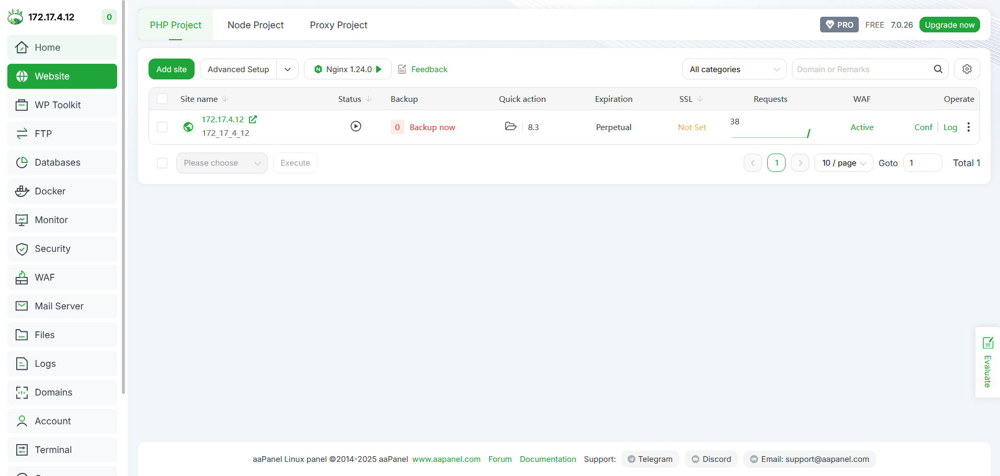

# Procédure de Déploiement

Décrivez ci-dessous votre procédure de déploiement en détaillant chacune des étapes. De la préparation du VPS à la méthodologie de déploiement continu.

## Préparation du VPS

Dans un premier temps je fait un git clone du projet dans mon cas : **git clone https://github.com/Metz-Numeric-School/habit-tracker-buggy-web-app-bloc-4-dfs-2025-bis-Clementk57**

Je vérifie que cela fonctionne en local :
**composer dump-autoload -o**

**composer check-platform-reqs**

**composer install --optimize-autoloader**

**php bin/serve

**

dès que je commance la préparation du déploiment
je fait un **git init**

**git add .
git cliff --init**
**git commit -m "inital"**

**ceci a faire a la fin pour mettre le changeLog a jour avec les tag et commit : git cliff --bump -o CHANGELOG.md**

**SUR LE SERVEUR 
PREPARER LE REPO QUI VA ACCEUILLIR LE PROJET :
cd /var/
MKDIR depot_git
cd /depot_git
git init --bare**

EN CAS DE PROBLEME AVEC GIT sur le serveur :
apt update
apt install -y git

Je prépare la connexion sur le repo sur le serveur :
**git remote add vps root@192.168.222.137:/var/depot_git**
**git tag 1.0.0
git push -u vps 1.0.0**

**SUR LE SERVEUR
ATTENTION POUR LA SUITE IL FAUT AVOIR CREE LE DOSSIER DANS AAPANEL COTE DEPLOIMENT
git --work-tree=/www/wwwroot/172.17.4.12--git-dir=/var/depot_git checkout -f 1.0.0**

## Méthode de déploiement

Dès qu'on a le SERVEUR on installe AAPANEL pour l'herbergement 

URL=https://www.aapanel.com/script/install_7.0_en.sh
&& if [ -f /usr/bin/curl ];then curl -ksSO "$URL" ;else wget
--no-check-certificate -O install_7.0_en.sh "$URL";fi;bash
install_7.0_en.sh aapanel

**https://172.17.4.12:35185**

**username :MetzNumeric
password : azer**

*lancer installation en LNMP ( celuide gauche )*

puis attendre que tout s'intalle

puis on va dans l'onget website et on crée un site en mettant l'ip du server 

**ON MET en running directory /public**

**Puis c'est fini et on peut voir le site
la db n'est pas affilier met pour crée une db on peut la crée sur appanel**

**password : bnffrwrSBcidRnH8

ON peut ce rentre sur phmyadmin :

Rentrer les information
username :habit_tracker
password :bnffrwrSBcidRnH8

puis on peut exécuter le script qu'on dans le projet :
database.sql pour crée les tables
demo_data.sql : pour inserer les donnes dans les tables 

on le met dans le .env et le projet et le website on peut le consulter :**

j'ai mis en place tout la suite du projet  mais j'ai rencontrer des problemes que je vais montrer ci-dessous :

***PHP Fatal error:  Uncaught Error: Call to undefined function Composer\XdebugHandler\putenv() in phar:///usr/bin/composer/vendor/composer/xdebug-handler/src/Process.php:93
Stack trace:
#0 phar:///usr/bin/composer/vendor/composer/xdebug-handler/src/Status.php(48): Composer\XdebugHandler\Process::setEnv()
#1 phar:///usr/bin/composer/vendor/composer/xdebug-handler/src/XdebugHandler.php(83): Composer\XdebugHandler\Status->__construct()
#2 phar:///usr/bin/composer/bin/composer(16): Composer\XdebugHandler\XdebugHandler->__construct()
#3 /usr/bin/composer(24): require('...')
#4 {main}
  thrown in phar:///usr/bin/composer/vendor/composer/xdebug-handler/src/Process.php on line 93*
**

**Pour régler ce probleme il faut aller dans : nano /www/server/php/83/etc/php.ini**

**et surpprimer le putenv dans le bloc disable_functions =**

Puis j'ai rencontrer un deuxieme problème :
***Fatal error** :  Uncaught Error: Class "Mns\Buggy\Core\Kernel" not found in /www/wwwroot/172.17.4.12/public/index.php:13
Stack trace:
#0 {main}
  thrown in **/www/wwwroot/172.17.4.12/public/index.php** on line **13**
*

**Pour régler ce deuxieme probleme il faut re aller dans : nano /www/server/php/83/etc/php.ini**
supprimer proc_open

**puis aller a l'endroit du projet sur serveur dans mon cas  :cd /www/wwwroot/172.17.4.12/**

et rentrer ces commande :
**rm -rf vendor/ var/cache/*
composer clear-cache
composer install --no-dev --optimize-autoloader**
