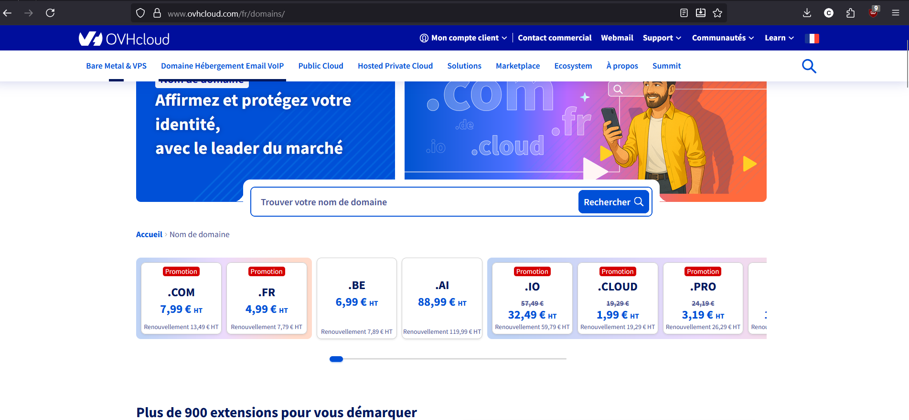
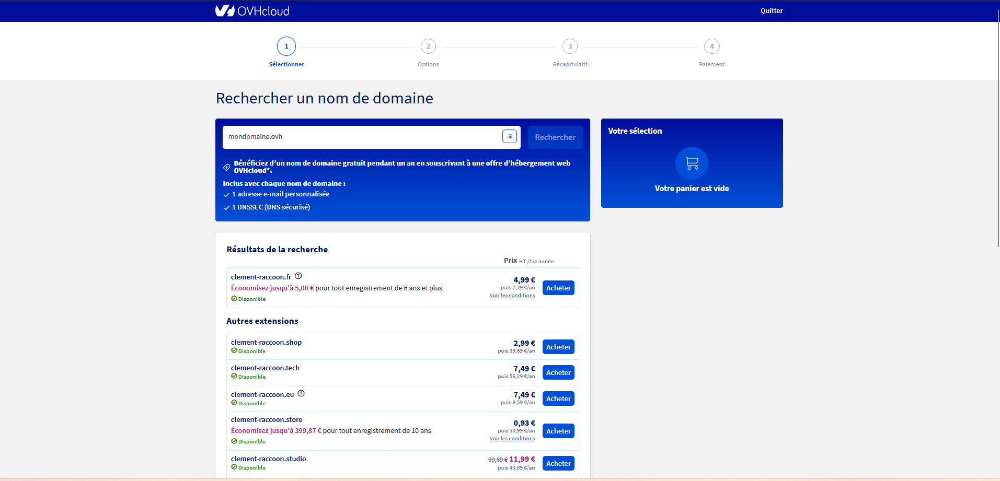
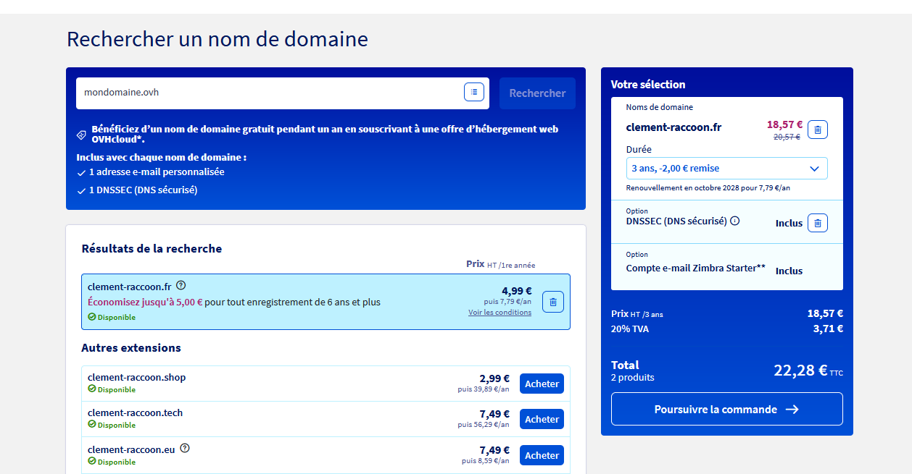
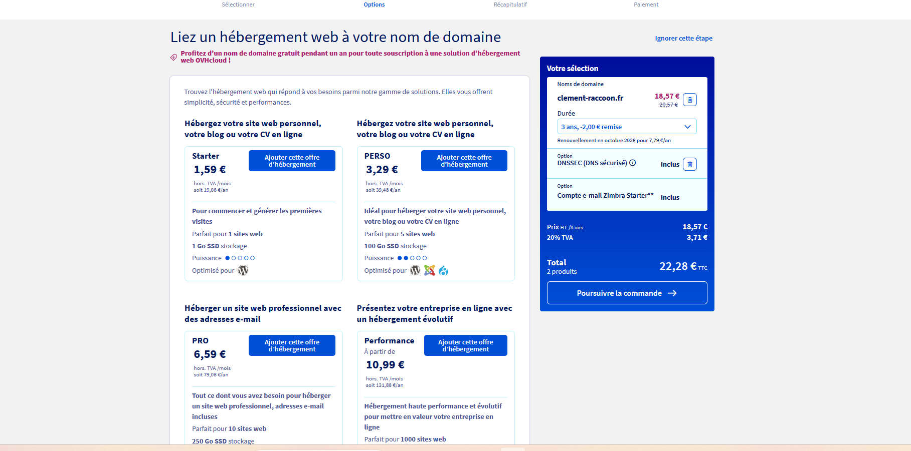
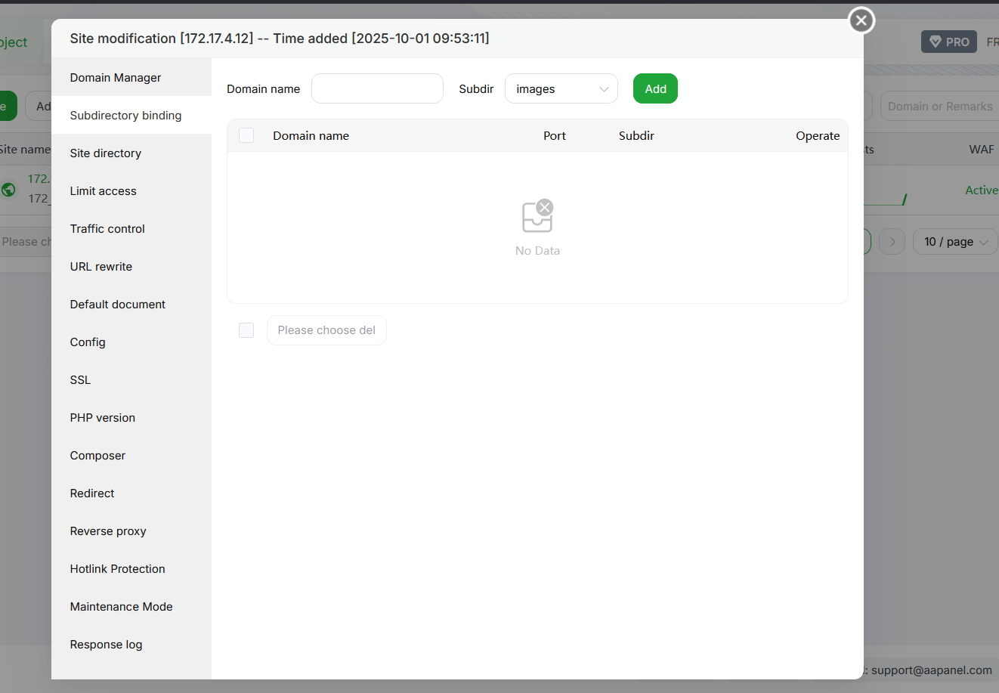
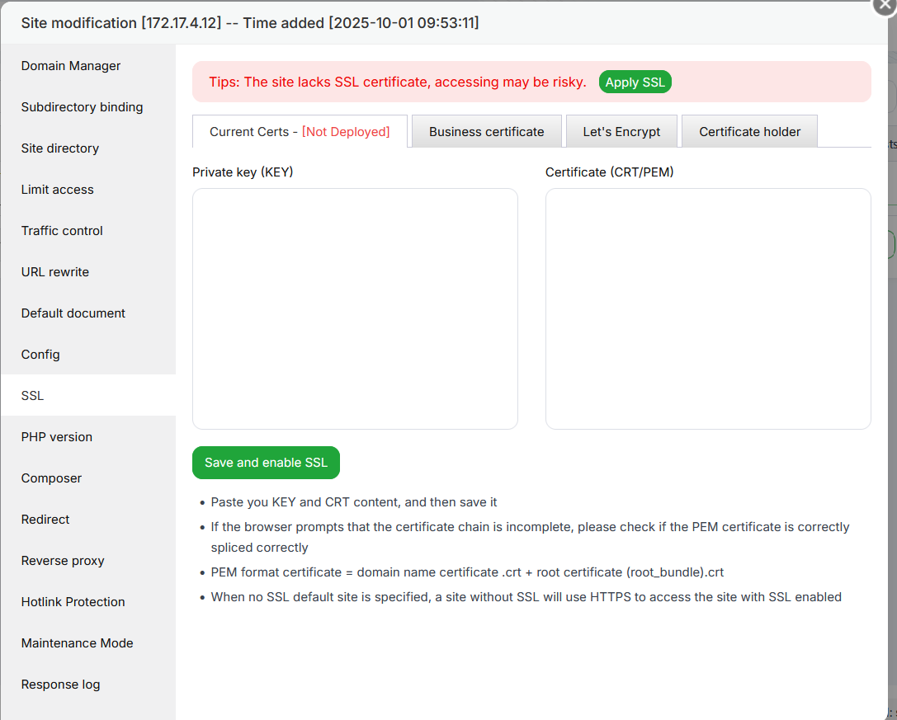

# Questions

Répondez ici aux questions théoriques en détaillant un maxium vos réponses :

1) Expliquer la procédure pour réserver un nom de domaine chez OVH avec des captures d'écran (arrêtez-vous au paiement) :
   aller sur ovh acheter un nom de domaine

   

   chosir son point j'ai choisie un point .fr
   

   On vérfie sa dispoiniblité car on peut pas avoir deux site qu'on le meme nom de domaine : dans mon cas j'ai choisie clement-raccoon
   je chosie sur combien de temps je voudrais le prendre
   

   je chosie une option qui correspond a ce que je veux dans mon cas : je chosie le premier pour 1,56 euro
   

   Puis apres vous l'acheter

2. Comment faire pour qu'un nom de domaine pointe vers une adresse IP spécifique ?
   Sur aapanel on a juste besoins de le mettre dans les config du website :
   
3. Comment mettre en place un certificat SSL ?
   Dans aapanel pour ajouter le SSL on doit juste cliquer sur apply SSL
   
