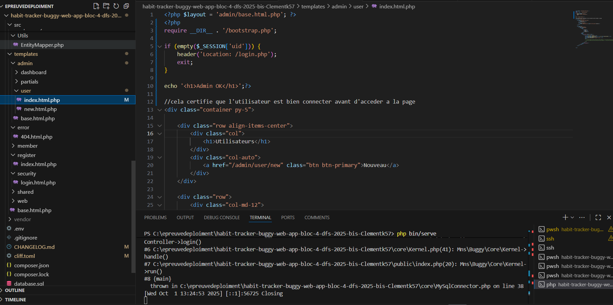
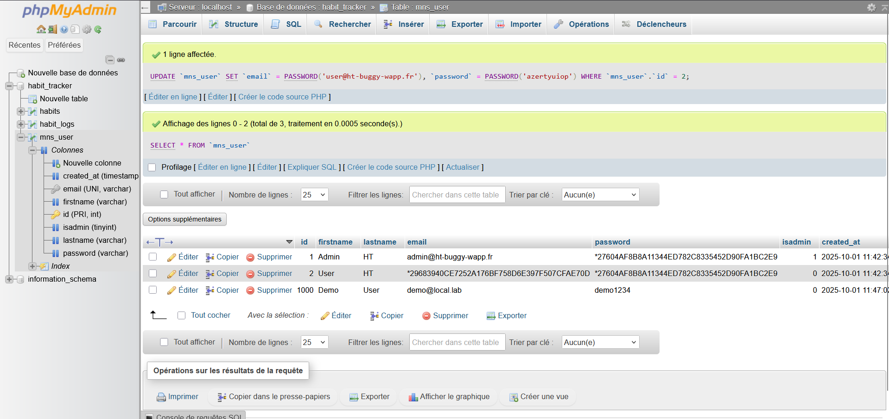
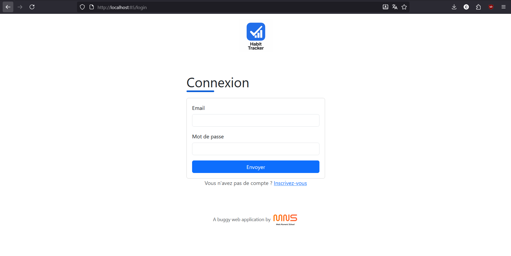

# TODO

Suite à un audit effectué en amont, voici les failles et les bugs qui ont été identifés comme prioritaire.

## FAILLES

* Des utilsateurs non admin ont des accès à l'interface de gestion des utilisateurs

  
* Les mots de passes ne sont pas chiffrée en base de données...
  

  **il suffit d'utliser la fontion password comme j'ai fait ducoup tout les prochain mot de passe seront haset mais on peut aussi le faire dans le code
  dans le sql
  `password_hash($plain, PASSWORD_DEFAULT)`**
* Des injections de type XSS ont été détéctées sur certains formulaires
* On nous a signalé des injections SQL lors de la création d'une nouvelles habitudes

  * exemple dans le champs "name" : foo', 'INJECTED-DESC', NOW()); --

    **malheursment je peux pas faires des test sur les resolution de faille XSS mais :**

    ## XSS (Cross‑Site Scripting)

    - **But de l’attaquant** : faire exécuter du JS dans le navigateur de ta victime (vol de session, actions à sa plaetcccc on peux tout prendre avec quelque script).
    - **Pourquoi ça arrive** : tu **réaffiches** des données entrées par l’utilisateur **sans échappement adapté au contexte**.
    - **Trois familles** :**Reflected** : l’entrée voyage dans l’URL/form et est renvoyée immédiatement.
    - **Stored** : l’entrée est stockée (BD) puis ressort affichée à tous.
    - **DOM‑based** : la vulnérabilité est dans le JS côté client (manipulation du DOM avec une source non fiable).
  * un exemple qui ne prensent pas de faill 

      $sql = "INSERT INTO mns_user (lastname, firstname, email, password, isadmin) VALUES (:lastname, :firstname, :email, :password, :isadmin)";

        $query = $this->getConnection()->prepare($sql);

        $query->execute($data);

        return$this->getConnection()->lastInsertId();

## BUGS

* Une 404 est détéctée lors de l'accès à l'URL ``/habit/toggle``
* Fatal error: Uncaught Error: Class "App\Controller\Api\HabitsController" lorsque l'on accède à l'URL  ``/api/habits``

  j'ai fait la route et maitneant cela fontionne
  

**ATTENTION : certains bugs n'ont pas été listé**

POUR FAIRE UN LOGIN Sécuriser sans SQL injection on fait des requete preparer Et comme dit en haut on met le mot de passe en haset

verify_csrf_or_die();

$email    = trim((string)($_POST['email'] ?? ''));

$password =
(string)($_POST['password'] ?? '');

$user =
find_user_by_email($email);

if (!$user
|| !password_verify($password, $user['password_hash'])) {

    http_response_code(401);

    exit('Invalid credentials');
